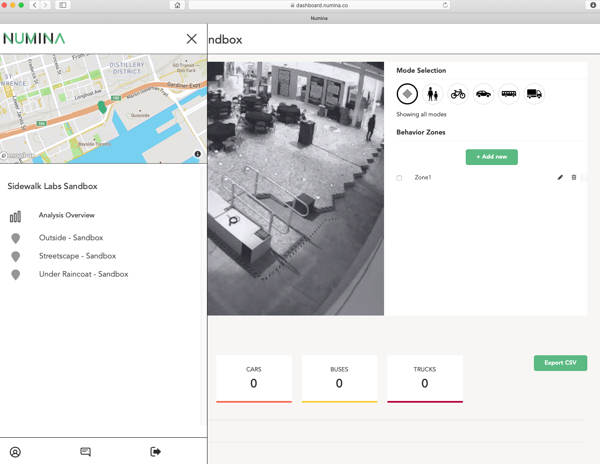
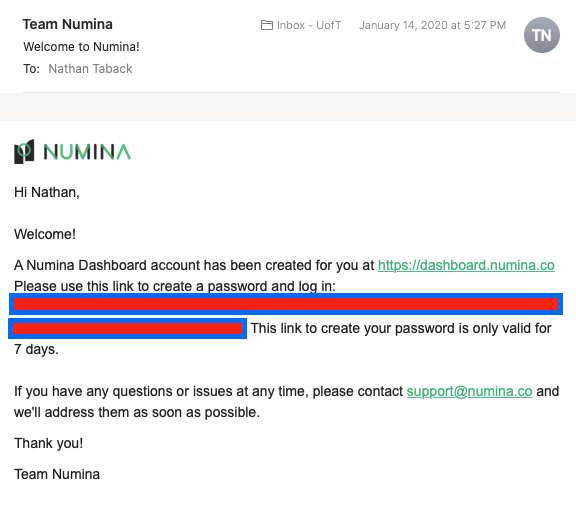

# STA2453 Project #3

## Questions

- How can the data be used to understand desire lines i.e. where people come from and where they go?


- How can we use the data to understand dwell time at 307? Where are areas of 307 that people pass through? Where do people tend to linger? Can we develop a map of “dwell time” at 307 and understand how it changes over time?


- Does weather play a role in the number of visitors to 307?  What are the impact of events (see calendar of events) at 307 on desire lines and dwell time?  What are the most successful events at 307? Create a definition of “success” (most visitors, or visitors spending the most time) and see if that changes the result.

- 307 requires maintenance after 500 visitors or 500 hours of use, when should 307 plan on scheduling maintenance operations (e.g., what days and times)?


## The Assignment

1. Create an interactive web page (e.g., dashboard) using libraries such as  [ipywidgets - Python only](https://ipywidgets.readthedocs.io/en/stable/), [Shiny - R only](https://shiny.rstudio.com), or [Dash - Python/R:](https://dash.plot.ly/?_ga=2.1439601.1178202398.1582144121-2143099458.1533934056) [dashR library](https://dashr.plot.ly/installation); [dash Python library](https://dash.plot.ly)

2. Create user documentation for your interactive web page that explains the data and statistics displayed on the page.


# 307 Calendar of Events

<em><mark>Coming soon ... </mark></em>


# Data Access Using the Numina API

The 307 data can be accessed using the [Numina API](https://developer.numina.co/#introduction).  


## A few more items from Numina that may be helpful


- A [sample Menu of Metrics](https://docs.google.com/presentation/d/11VPloAa6Lfe2G0Llekp5yVabzgqkU-bAb9rCVCI57mI/edit?usp=sharing) that shows some example data science questions and analyses.


- A [presentation](https://numina.co/numina-presents-at-transit-techies-nyc/) given at Numina that shows how some of our data is structured and how Behavior Zones work on the backend. The relevant technical pieces start around 7:42.


- [Downtown Brooklyn Case Study](https://numina.co/developers-annotation-dbp/)


## Access data via the Numina Dashboard

- Login to the dashboard and select a sensor.

- Select mode.

- <mark> Add a behviour zone (optional).</mark> 

- Select time frame.

- Export CSV.



<br>
<br>

## Steps to access the data using the API

1. Setup your Numina login and password.




2. The login and password that you setup using the dashboard can be used to access data via the API.  The Numina API is a GrpahQL API.  If this is your first time working with GraphQL then you can learn the fundamentals [here](https://www.howtographql.com), but we are really only going to be using some basic queries to fetch data.  


3. Once you have setup your account then you are ready to get a login token from the Numina API. It's good practice to keep your credentials confidential. So, store your login and password in another file, say `login.R`.  To label a block of code in a script, you write the label after `## ----` (optionally, you can add a series of dashes to the end of this line). 


The file `login.R` should contain:


```r
## ---- logpass
login <- "\"yourname@utoronto.ca\""
pwd <- "\"yourpassword\""
```


<mark>**NB: In order to use quotation marks in the queries you need to include a \\ before each quotation mark **</mark>  Backslash is used to "escape" quotations (i.e., \\ causes an escape from the way characters are interpreted), since quotations have a special menaing in R (see [Quotes](https://stat.ethz.ch/R-manual/R-devel/library/base/html/Quotes.html)).

`login` and `pwd` can be included in an RMarkdown file by including the following chunk:

````markdown
```{r, include=FALSE, cache=FALSE}
source("login.R")
```
````

You can read more about including chunks from external source [here](https://bookdown.org/yihui/rmarkdown-cookbook/source-script.html).


Now, you can authenticate and get a token.  Be sure to include the chunk label `logpass` in the chunk.  


````markdown
```{r, logpass, echo=TRUE}
numina_url <- "https://api.numina.co/graphql"

loginq <- paste("mutation {
  logIn(
      email:",login,",password:",pwd,") {
    jwt {
      token
      exp
    }
  }
}")


mylogin <- POST(url = numina_url, body = list(query = loginq), encode = "json")

#extract content from request
res <- content(mylogin)
#extract content from request
res <- content(mylogin)
# get token
token <- res$data$logIn$jwt$token
```
````


## Sample Queries

The following query requests all devices (sensors) serial number, and `rawId` that can be used as a unique way to identify the device in other requests.  


```r
query1 <- "query {
  devices {
    count
    edges {
      node {
        rawId
        name
        serialno
      }
    }
  }
}"

devices <- POST(url = numina_url, body = list(query = query1), add_headers(Authorization = token) , encode = "json")
res <- content(devices)
```

## Counts

[Counts queries are used to get counts of objects that were observed in a given time interval.](https://developer.numina.co/#counts)

The following query finds the number of pedestrians detected daily by the indoor sensor (the sensor that has name Streetscape - Sandbox) from 2019-12-01 to 2019-12-31. 


```r
query2 <- "query {
  feedCountMetrics(
    serialnos:[\"SWLSANDBOX1\"],
    startTime:\"2019-12-01T00:00:00\",
    endTime:\"2020-01-01T00:00:00\",
    objClasses:[\"pedestrian\"],
    timezone:\"America/New_York\",
    interval:\"24h\") {
    edges {
      node {
        serialno
        result
        objClass
        time
      }
    }
  }
}"

devices <- POST(url = numina_url, body = list(query = query2), add_headers(Authorization = token) , encode = "json")
res <- content(devices)
```


### Heatmaps

[A heatmap is an array of values representing the spatial distribution of activity levels.](https://developer.numina.co/#heatmaps)


```r
query3 <- "query {
  feedHeatmaps(
    serialno: \"SWLSANDBOX1\",
    startTime:\"2019-12-01T00:00:00\",
    endTime:\"2019-12-31T00:00:00\",
    objClasses:[\"pedestrian\"],
    timezone:\"America/New_York\") {
    edges {
      node {
        time
        objClass
        heatmap
      }
    }
  }
}"

query3 <- ""

heat <- POST(url = numina_url, body = list(query = query3), add_headers(Authorization = token) , encode = "json")
res <- content(heat)
```

